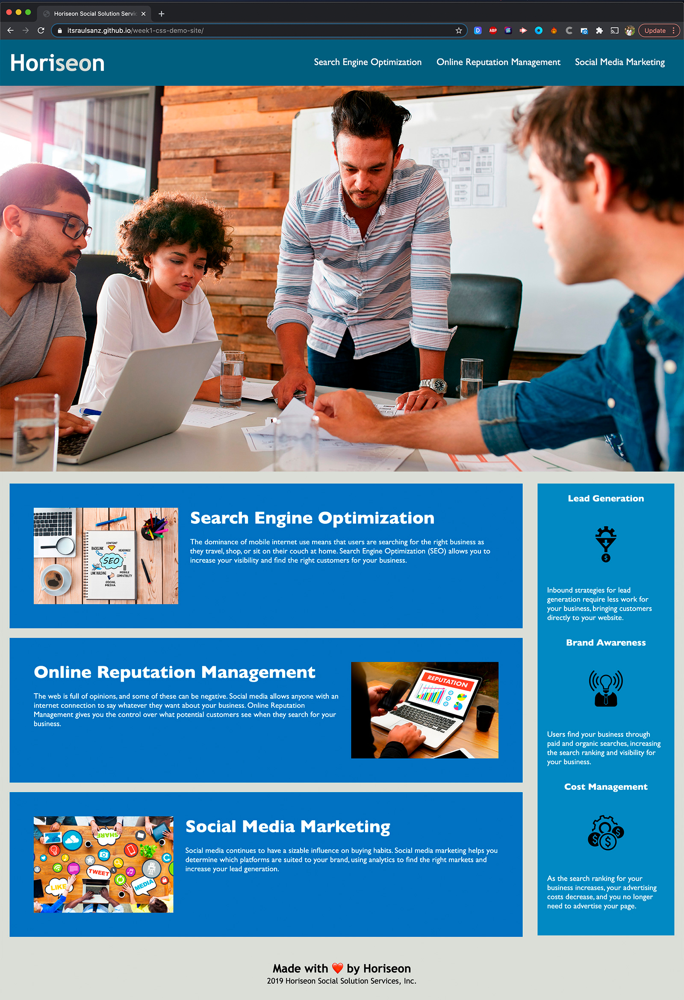

# 01 HTML CSS Git: Code Refactor

## Description

This repository contains the refactored Horiseon website to achieve an accessible website with a cleaner code and a sustainable codebase.

## Improvements

**HTML**

- Changed the title "website" to "Horiseon Social Solution Services"

- Added alt properties for each image with a description

- Added the id tag into the main 3 sections, to make the nav links work

- Changed div class="header" to header
- Changed the div who contained the menu to nav
- Changed div class="content" to main
- Changed div class="benefits" to aside
- Changed div> inside the main and aside columns to article 
- Changed div class="footer" to footer

- Used the same class (.featured) for .search-engine-optimization, .online-reputation-management and .social-media-marketing
- Deleted the id tag for online-reputation-management and social-media-marketing
- Used the same class (.benefit) for .benefit-lead, .benefit-brand and .benefit-cos

- Deleted "& copy;" from the footer text.

**CSS**

- Used the same class (.featured) for .search-engine-optimization, .online-reputation-management and .social-media-marketing
- Used the same class (.featured img) for .search-engine-optimization h2, .online-reputation-management h2 and .social-media-marketing h2
- Used the same class (.featured img) for .search-engine-optimization img, .online-reputation-management img and .social-media-marketing img

- Used the same class (.benefit) for .benefit-lead, .benefit-brand and .benefit-cos
- Used the same class (.benefit h3) for .benefit-lead h3, .benefit-brand h3 and .benefit-cos h3
- Used the same class (.benefit img) for .benefit-lead img, .benefit-brand img and .benefit-cos img

**IMAGES**

- Reduced the file size of the images (web images optimization)

## Deployed Application

Website URL: <a href="https://itsraulsanz.github.io/week1-css-demo-site/">https://itsraulsanz.github.io/week1-css-demo-site/</a>

